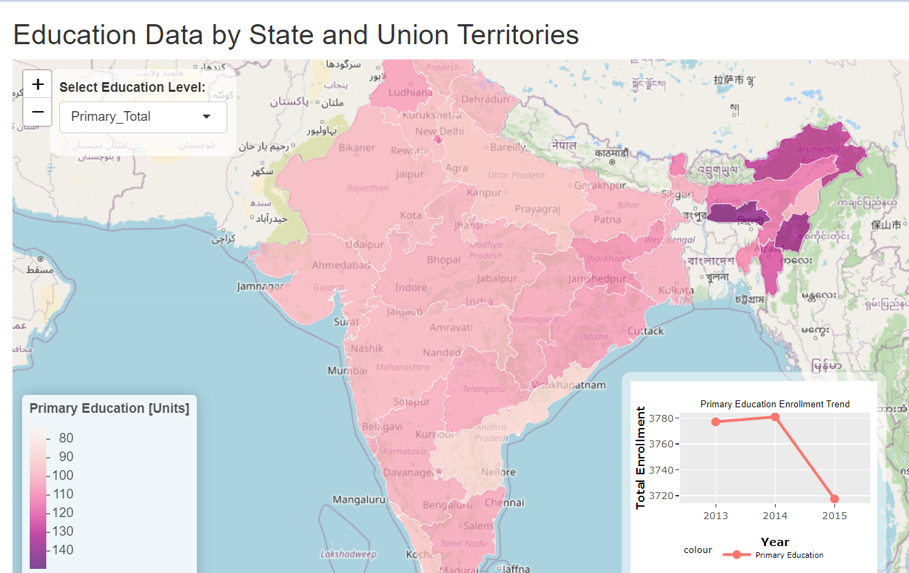

# R
# Education Data Visualization

This visualization displays **education data by state and union territories in India**, focusing on **Primary Education**. The chart is created using **R** and showcases an interactive dashboard with the following features:

## Features
1. **Interactive Map**:
   - Displays education data across different states using a **choropleth map**.
   - Color gradient represents the magnitude of data (e.g., enrollment numbers in primary education).
   - Hovering over a state displays detailed information (e.g., "State: Uttar Pradesh, Primary Education: 95").

2. **Color Legend**:
   - Located at the bottom-left corner, the legend explains the color gradient, where lighter shades represent lower values, and darker shades represent higher values.

3. **Trend Line Chart**:
   - Located at the bottom-right corner, the line chart shows the enrollment trend in **Primary Education** across the years (e.g., 2013-2015).
   - The chart indicates a downward trend in total enrollment during this period.

4. **Dropdown Selection**:
   - Users can select different **education levels** (e.g., "Primary_Total") to view corresponding data dynamically.

---

### Example Image

---

This visualization was created using **R** libraries such as `leaflet`, `ggplot2`, and possibly `shiny`. It effectively combines geographic and statistical data to provide actionable insights into education distribution and trends.

# 教育数据可视化

此图展示了**印度各邦和联邦属地的教育数据**，重点关注**小学教育**。该图表由 **R** 绘制，包含以下交互式功能：

## 功能特点
1. **交互式地图**：
   - 通过**分级着色地图（Choropleth Map）**显示各邦的教育数据分布。
   - 颜色梯度表示数据的大小（例如小学教育的入学人数）。
   - 鼠标悬停在某邦时，可查看详细信息（如 "邦：北方邦，小学教育：95"）。

2. **颜色图例**：
   - 左下角显示颜色图例，浅色表示较低数值，深色表示较高数值。

3. **趋势折线图**：
   - 右下角的折线图显示了小学教育在多个年份（如 201

